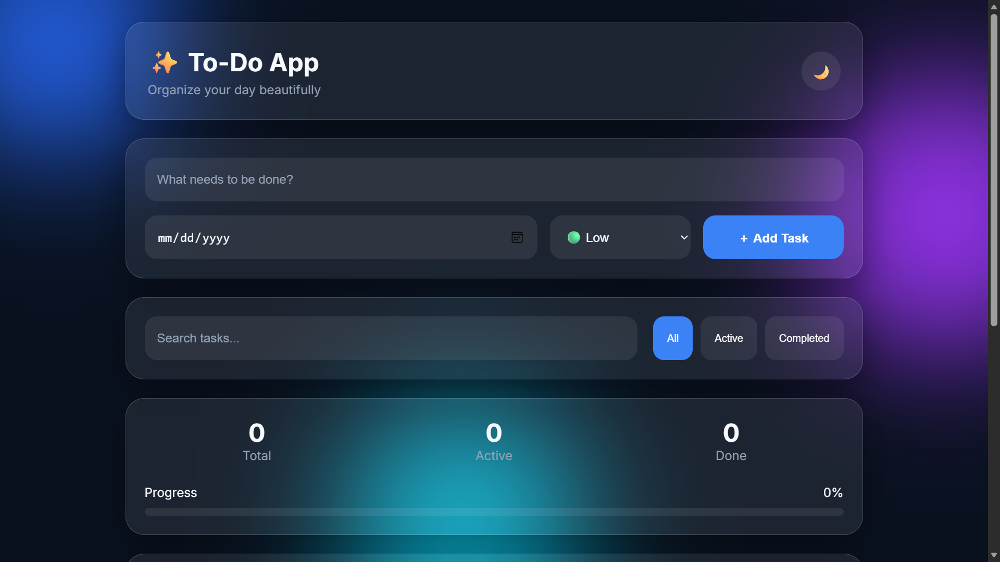

# ✨ To-Do App

A modern, responsive, and feature-rich Todo web application built using **HTML, CSS, and JavaScript**.

To-Do App uses a **Glassmorphism UI** with a clean and intuitive experience to help users organize their daily tasks efficiently.

## 🚀 Features

- ✅ Add tasks
- ✏️ Edit tasks
- 🗑️ Delete tasks
- ☑️ Mark tasks as completed
- 🔍 Search tasks
- 🏷️ Priority levels (Low, Medium, High)
- 📅 Due dates
- 📊 Progress tracking
- 📈 Task statistics
- 🎯 Filter tasks (All, Active, Completed)
- 🌙 Dark mode toggle
- 💾 Local Storage persistence
- 📱 Fully responsive design
- ✨ Smooth animations
- 🎨 Glassmorphism UI

## 🖼️ Preview
```html
<p align="center">

  

</p>
```


## 🛠️ Tech Stack

- HTML5
- CSS3
- JavaScript (Vanilla JS)
- Local Storage API

## 💾 Data Persistence

Tasks are stored using the browser's **Local Storage**.

Tasks will remain available after:

- Refreshing the page
- Closing the browser
- Restarting the device

Tasks are removed only when:

- A task is deleted
- Completed tasks are cleared
- Browser storage is manually cleared

## 📱 Responsive Design

The application is optimized for:

- 📱 Mobile devices
- 📲 Tablets
- 💻 Laptops
- 🖥️ Desktop screens

## 🎨 UI Design

This project follows Glassmorphism principles:

- Background blur
- Semi-transparent cards
- Soft shadows
- Rounded corners
- Smooth transitions

## 🔮 Future Improvements

Potential features:

- 🔔 Notifications
- 🖱️ Drag and drop
- 🏠 Progressive Web App (PWA)
- 📌 Pin important tasks
- 📂 Categories
- 🏷️ Custom tags
- 📊 Weekly analytics
- 🔄 Cloud sync

## 📄 License

This project is open-source and available under the MIT License.

---

Built with ❤️ by Mukesh.

